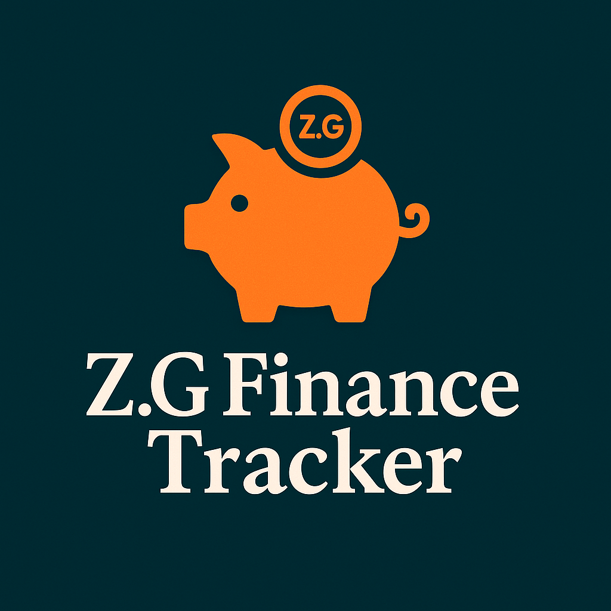

# 💰 Personal Finance Tracker

A simple GUI-based personal finance tracking application built with Python and `customtkinter`. This app allows users to register, log in, and manage their incomes and expenses. It also provides financial reports and stores all user data securely in a JSON file.



---

## 🧰 Features

- 📝 User Registration & Login
- ➕ Add Income with amount and source
- ➖ Add Expenses with category and description
- 📊 View a Financial Report:
  - Total income
  - Total expenses
  - Net savings
  - Top 3 expense categories
- 📋 View all recorded expenses
- 🔒 Secure data storage in `data.json`

---

## 🛠 Technologies Used

- **Python 3**
- **customtkinter** — For a modern and responsive UI
- **tkinter** & `ttk` — Native GUI components
- **Pillow** — Image support
- **JSON** — For data persistence

---

## 🚀 Getting Started

### 1. Clone the Repository

```
git clone https://github.com/yourusername/personal-finance-tracker.git
cd personal-finance-tracker
```

### 2. Install Dependencies

Make sure you have Python 3 installed, then install the required packages:

```
pip install customtkinter pillow
```

### 3. Run the App

```
python main.py
```


---

## 📂 Project Structure

```
📁 personal-finance-tracker/
├── main.py
├── data.json
└── piggybank.png
```
---

## 📝 Notes

- All user data is saved in `data.json`.
- The app uses a simple in-memory user authentication system.
- You can change the UI theme by modifying:
  ```python
  CTk.set_appearance_mode("dark")
  CTk.set_default_color_theme("green")
  ```

---

## 🧑‍💻 Author

Created by zakariya gori.

---

## 📄 License

This project is open-source and available under the [MIT License](LICENSE).
```
